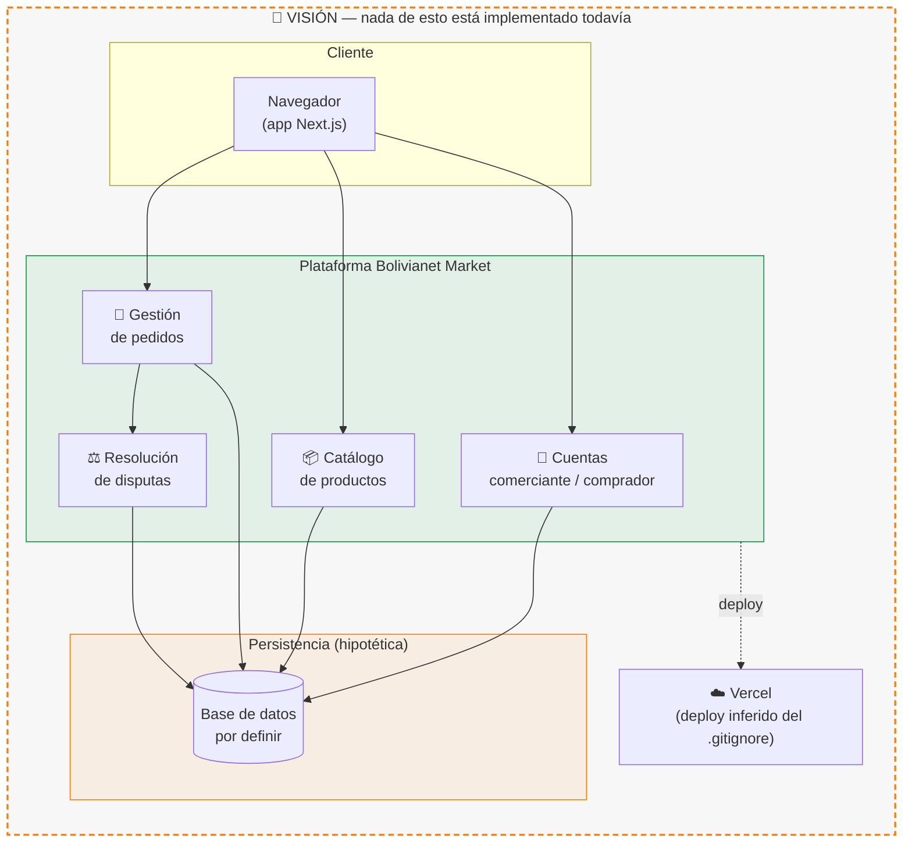
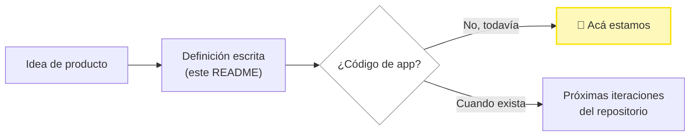
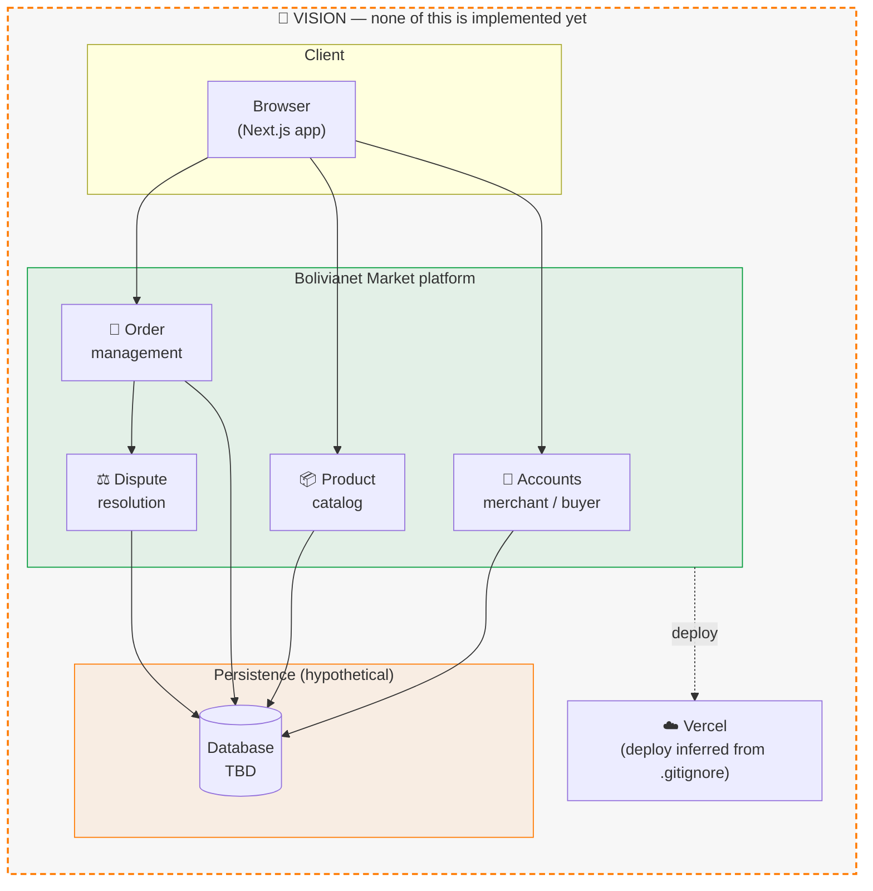
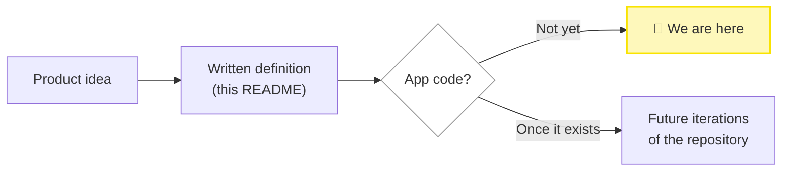

<p align="center">
  
</p>

<p align="center">
  
</p>

<p align="center">
  
  
  
  
</p>

<p align="center">
  <a href="#español"><b>🇧🇴 Español</b></a> &nbsp;·&nbsp; <a href="#english"><b>🇬🇧 English</b></a>
</p>

---

<a name="español"></a>
## 🇧🇴 Español

### 📑 Tabla de contenidos

- [¿Qué es esto?](#qué-es-esto)
- [Visión / arquitectura planeada](#visión--arquitectura-planeada)
- [Estado actual](#estado-actual)
- [Roadmap tentativo](#roadmap-tentativo)
- [Licencia](#licencia)
- [Autor](#autor)

---

### ¿Qué es esto?

**Bolivianet Market** es la definición de producto para un futuro marketplace digital pensado específicamente para Bolivia. La idea, tal como la planteó el autor, es la de una plataforma donde:

- **Comerciantes** puedan publicar y administrar sus propios productos.
- Cada venta genere un **pedido** que se pueda seguir de principio a fin (creación, estado, cierre).
- Exista un **sistema de resolución de disputas con respaldo** entre comprador y vendedor, para dar confianza a ambas partes.

Es, por ahora, **solo eso: una visión documentada**. Este repositorio no contiene ninguna aplicación funcional — no hay backend, no hay frontend, no hay base de datos ni lógica de negocio implementada. Lo único que existe es un `.gitignore` con la plantilla estándar de un proyecto Next.js (lo que sugiere la tecnología con la que se planea construir esto) y este mismo README, escrito para dejar constancia clara del objetivo del proyecto mientras no exista código.

Este documento prioriza la honestidad sobre el relleno: no vas a encontrar aquí instrucciones de instalación, capturas de pantalla ni una lista de "features implementadas", porque nada de eso existe todavía.

### Visión / arquitectura planeada

El siguiente diagrama **no describe nada implementado**. Es una proyección razonable de cómo se vería la arquitectura si el proyecto avanza según la pista tecnológica que deja el `.gitignore` (Next.js + Vercel), pensada únicamente como referencia para cuando el desarrollo arranque.



> ⚠️ **Aclaración explícita:** ni el catálogo, ni la gestión de pedidos, ni el sistema de disputas, ni la capa de datos existen en este repositorio. El diagrama es una hipótesis de diseño, no documentación de algo construido.

### Estado actual

Esto es exactamente lo que existe hoy en el repositorio, sin agregar ni un archivo más de lo real:

```
Bolivianet_Market/
├── .gitignore     # Plantilla estándar de un proyecto Next.js
└── README.md      # Este documento
```

No hay `package.json`, no hay carpetas `app/`, `pages/`, `src/` ni `api/`, no hay dependencias declaradas, no hay backend ni base de datos, y no hay ningún commit con lógica de aplicación.



### Roadmap tentativo

Ningún ítem de esta lista está confirmado con fecha ni comprometido por el autor; es simplemente el orden lógico en el que tendría sentido construir la visión descrita arriba.

- [ ] Inicializar el proyecto Next.js y definir la arquitectura base.
- [ ] Diseñar el modelo de datos (productos, comerciantes, pedidos, disputas).
- [ ] Implementar autenticación y perfiles (comerciante / comprador).
- [ ] Catálogo de productos (publicación y gestión por parte del comerciante).
- [ ] Flujo completo de pedidos (creación, seguimiento, estados, cierre).
- [ ] Sistema de resolución de disputas con respaldo.
- [ ] Definir método(s) de pago adaptados al contexto boliviano.
- [ ] Desplegar una primera versión en Vercel.

### Licencia

No existe un archivo `LICENSE` en el repositorio. Por lo tanto:

**Todos los derechos reservados — proyecto de jackson1939.**

Aunque el repositorio es públicamente visible en GitHub, esto no otorga ninguna licencia de uso, copia, modificación o distribución del contenido sin autorización expresa del autor.

### Autor

<p align="left">
  <a href="https://github.com/jackson1939"></a>
</p>

---

<a name="english"></a>
## 🇬🇧 English

### 📑 Table of contents

- [What is this?](#what-is-this)
- [Vision / planned architecture](#vision--planned-architecture)
- [Current status](#current-status)
- [Tentative roadmap](#tentative-roadmap)
- [License](#license)
- [Author](#author)

---

### What is this?

**Bolivianet Market** is the product definition for a future digital marketplace conceived specifically for Bolivia. The idea, as laid out by the author, is a platform where:

- **Merchants** can publish and manage their own products.
- Every sale creates an **order** that can be tracked from start to finish (creation, status, closing).
- A **dispute-resolution system with backing** exists between buyer and seller, so both sides can trust the platform.

For now, **that's all it is: a documented vision**. This repository contains no working application — no backend, no frontend, no database, no business logic. The only things that exist are a `.gitignore` matching the standard Next.js template (hinting at the intended tech) and this README, written to clearly record the project's goal while no code exists yet.

This document favors honesty over padding: you will not find installation instructions, screenshots, or a list of "implemented features" here, because none of that exists yet.

### Vision / planned architecture

The diagram below **describes nothing that is implemented**. It is a reasonable projection of what the architecture could look like if the project moves forward along the technical hint left by the `.gitignore` (Next.js + Vercel), meant purely as a reference for when development actually starts.



> ⚠️ **Explicit disclaimer:** the catalog, order management, dispute system, and data layer do not exist in this repository. The diagram is a design hypothesis, not documentation of something built.

### Current status

This is exactly what exists in the repository today, nothing more:

```
Bolivianet_Market/
├── .gitignore     # Standard Next.js project template
└── README.md      # This document
```

There is no `package.json`, no `app/`, `pages/`, `src/` or `api/` folders, no declared dependencies, no backend or database, and no commit containing application logic.



### Tentative roadmap

None of these items carry a confirmed date or a commitment from the author; it is simply the logical order in which the vision above would make sense to build.

- [ ] Initialize the Next.js project and define the base architecture.
- [ ] Design the data model (products, merchants, orders, disputes).
- [ ] Implement authentication and profiles (merchant / buyer).
- [ ] Product catalog (publishing and management by merchants).
- [ ] Full order flow (creation, tracking, status, closing).
- [ ] Dispute-resolution system with backing.
- [ ] Define payment method(s) adapted to the Bolivian context.
- [ ] Deploy a first version on Vercel.

### License

No `LICENSE` file exists in this repository. Therefore:

**All rights reserved — project by jackson1939.**

Although the repository is publicly visible on GitHub, this grants no license to use, copy, modify, or distribute its content without the author's express authorization.

### Author

<p align="left">
  <a href="https://github.com/jackson1939"></a>
</p>

<p align="center">
  
</p>
